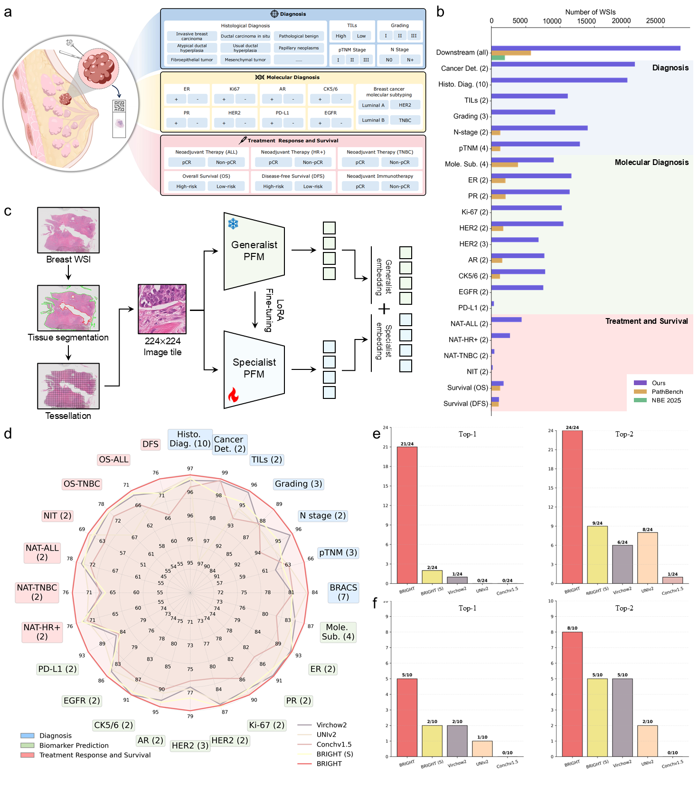

# 
# BRIGHT: A Collaborative Generalist-Specialist Foundation Model for Breast Pathology （Private for under review）

[](https://www.nature.com/nm/) 
[](https://huggingface.co/spaces/your-username/breastpath-demo) 
[](https://huggingface.co/your-username/breastpath-model) 
[](LICENSE)

This repository contains the official inference code and pre-trained weights for **BRIGHT**, a collaborative generalist-specialist foundation Model for breast pathology, as described in our paper.  **<span style="color: red;">The complete code will be publicly accessible upon publication of this article.</span>**

BRIGHT is a visual foundation model trained on a large-scale dataset of breast histopathology images. It supports a variety of downstream tasks including:

- Diagnosis (e.g., cancer detection, histopathology diagnosis, TILs, Grading, N-stage and pTNM staging)
- Biomarkers prediction and molecular subtyping (e.g., ER, PR, HER2, Ki67, AR, CK5/6, EGFR, PD-L1)
- Treatment response and survival (e.g., NIT, NAT, OS, DFS)
---



This repo provides a **lightweight demo** for the diagnosis task on the public dataset (BRACS dataset). 


## Requirements

- Python 3.8+
- PyTorch 1.12+ (tested with 2.0.1)
- CUDA 11.3+ (recommended, CPU inference also supported)
- OpenSlide (for WSI processing)
- Other dependencies: see `requirements.txt`

## Usage
<!-- 


```bash -->
Follow the steps below to reproduce the downstream evaluation pipeline using BRIGHT features on the BRACS dataset.

Note: The complete code will be made available upon publication. The instructions below outline the general workflow.

### 1. Download the BRACS dataset
Visit the BRACS official website and request access to the dataset.
```URL
https://www.bracs.icar.cnr.it/
```

After approval, download the whole-slide images (WSIs) and the corresponding annotations.

### 2. Extract features with TRIDENT (including new developed BRIGHT-S)
We use the TRIDENT framework for feature extraction.

Clone the TRIDENT repository ```https://github.com/mahmoodlab/TRIDENT ``` and follow its installation instructions.

For each foundation models (e.g., BRIGHT-S, Virchow2, UNIv2, Conchv1.5), run the extraction script of TRIDENT to obtain .h5 feature files for all tiles/patches.

**<span style="color: red;">P.S. To extract the features of BRIGHT-S, you will need the BRIGHT-S model weights and It will be publicly accessible upon publication of this article.</span>**

### 3. Organize extracted features
After extraction, you should have a set of .h5 files (one per WSI/model).
Create a folder structure under ```features_h5/``` like this:

```text
features_h5/
├── BRACS-S/
│   ├── BRACS_264.h5
│   ├── BRACS_265.h5
│   └── ...
├── Virchow2/
│   ├── BRACS_264.h5
│   └── ...
└── UNIv2/
    └── ...
└── Conchv1.5/
    └── ...
```
### 4. Create dataset splits
Prepare CSV files that define the training, validation, and test splits for your downstream task.


For the BRACS diagnosis task, you can use the official splits or create your own.
Place these CSV files in a folder (e.g., ./splits/).

### 5. Train downstream models using CLAM
We use the CLAM codebase for training and evaluation.

Example command (inside CLAM):

``` bash
CUDA_VISIBLE_DEVICES=0 python main_BRACS.py --model_type clam_sb --log_data --drop_out 0.25 --early_stopping --lr 2e-4 --k 1 --weighted_sample --bag_loss ce --inst_loss ce --subtyping --fm BRIGHT --task Bracs_label_7 --results_dir ./results --fm BRIGHT
```

### 6. Compute bootstrapped performance metrics
To obtain robust estimates with confidence intervals, run 1000 bootstrap iterations on the test predictions.
We provide a script bootstrap_eval.py that takes the test predictions and ground truth labels and computes metrics (accuracy, AUC, F1, etc.) with 95% CIs.

``` bash
python bootstrap_eval.py
```

For detailed parameter descriptions and advanced usage, please refer to the individual toolkits (TRIDENT, CLAM) and the scripts provided in this repository after publication.
